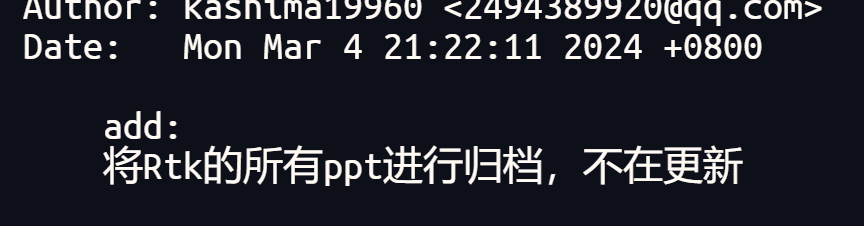
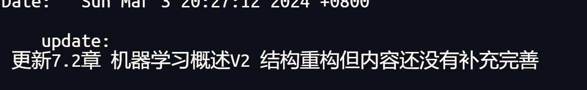
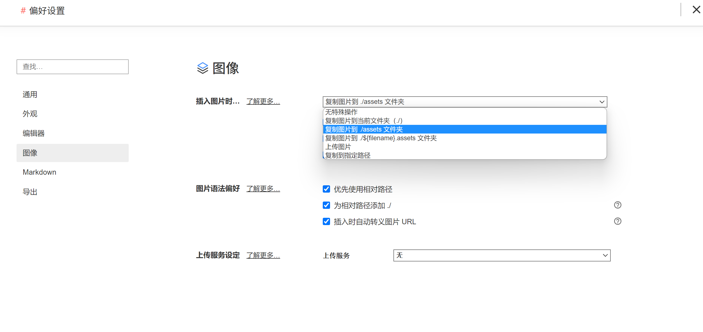
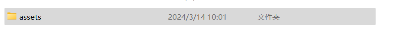
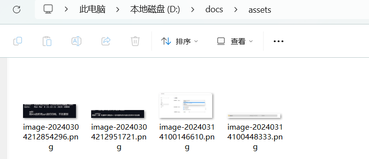

# blog

## 前言

本仓库存放用于发表博客的文档

## git commit的提交规范

1.  增加新的内容遵循如下格式

    add:

    -------说明

    

2.  更改内容遵循如下格式

    update: 

    --------说明

    

3.  删除内容遵循如下格式

delete:

--------说明

## 图像插入要求

markdowm的图像插入并不会直接嵌入到文件中，因此在插入图像时，请选择以下的选项

选择后，插入图片时会生成以下的文件夹

